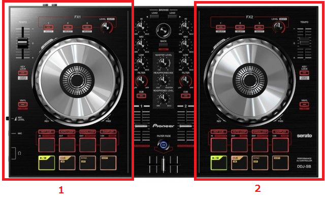

# Aizu_DMC 新入生向け資料

## はじめに
新入生の皆さん、ご入学おめでとうございます。本サークルに興味を持って頂き、ありがとうございます。m(\_ \_)m  
本サークル **Aizu_DMC** は、主に会津若松市内で活動しているDJサークルです。会津若松市内での主な活動先は、クラブ [Redink underground](http://redink.jp/) さんや、飲食店 [PRONTO](http://www.pronto.co.jp/shop/detail?shopid=0242288355) さん、[BARD LAND](https://www.facebook.com/BARD-LAND-273767529306903/) さんで、新歓や通常イベントを含めて約2か月おきにイベントをやらせて頂いています。  
その他にも部員の中には自分でイベントを立ち上げたり、県外や地元のイベントから声がかかって幅広く活動をしている部員もいます。

## DJって何？
一般的に、DJにはラジオDJといった意味も含まれますが、**Aizu_DMC** はクラブDJを専門に活動しています。クラブDJは、決められた時間内（枠内）で曲を絶えることなく繋ぎ続け、フロアのお客さん達を楽しませる役割を持ちます。ただ単に曲を流すだけではなく、お客さんを盛り上げる為に様々なテクニックや煽り方を身につけ、フロアを盛り上げているのです。  
ここで、「曲を繋ぐ？煽り？難しそう…」と感じた方、難しく考える必要はありません。このサークルに興味を持ってくれた音楽好きの皆さんは、自分の好きな曲を集め、iPodやWalkmanでプレイリストを作ったことがあると思います。曲の早さや、明るい曲、暗い曲など違和感の無いように再生順を並べ替えるこだわりのある人も居るかもしれません。そのプレイリストが、クラブDJへと続く初めの一歩です。実際にそのプレイリスト内の音楽達を繋ぐことを考えてみて下さい。実はその方法さえ確立すれば、貴方はもう立派なDJの一員になれるのです。  
近年の技術の進歩により、最新のDJ機材は個人で所有できるほど安く、また機材上には質の高い様々な機能が標準搭載されるようになりました。それにより曲のミックス技術が均整化した今、個人的な趣味としてもDJは認知されるようになって来ています。今回興味を持ってくれた方々も、構える必要はありません。是非気楽にDJに挑戦してみてください。  
以下の節では、本サークルで使っているDJ機材や実際にDJする上での技法などを説明します。

## DJ機器
### 周辺機器について
Aizu_DMCに所属している部員は主にPCDJを使っています。もしCDJやターンテーブルにも挑戦してみたい！という方がいたら是非相談してみて下さい。  
また、音を出力するのに必須項目であるミキサー、アンプ、スピーカーは部室に備品があるので個人で用意する必要はありません。  
これは必ず必要という訳ではありませんが、赤白のケーブルは個人で持っていると楽です。Amazonの検索結果を貼っておきますが、こちらはヤマダ電機さんなどでも取り扱っています。  
http://www.amazon.co.jp/s/ref=nb_sb_ss_i_5_7?&keywords=%E8%B5%A4%E7%99%BD%E3%82%B1%E3%83%BC%E3%83%96%E3%83%AB

#### PCDJ（DMC推奨）
PCDJを用いたDJは、自分のPCに入っている音源を元にDJを行うことになります。PCDJは他の部員から借りることが出来ますが、後々自分で練習したい時などに困るので早めの購入をおすすめしています。  
以下はAmazonでのPCDJ検索結果です。  
http://www.amazon.co.jp/s/ref=sr_nr_n_0?keywords=pcdj

値段帯は安いものだと2万ほどで買えますが、PCDJに備わっている機能は値段に正比例しており、コツを掴んできて少し凝ったことをしてみよう！と思った時思い通りにいかないこともあります。  
最初だから…と安い物を買うより、一生使い潰してやる！という気概で少し奮発しても良い物を買うことをおすすめしています。  

#### CDJ
CDに入っている音源を元にDJをする場合はCDJを使います。その場合、DMCの備品であるCDJ-100Sを使うことになります。このCDJは今から18年前に発売されたもの(1998年発売)で、相当な年月このサークルで使ってきている物なので結構ガタがきていますが、まだまだ現役で使えます！去年卒業した院生の方などはこれを使ってDJを行っていました。最新の機種のCDJではUSB内の音源でも出来るのですが、こちらはCDのみとなっています。  
現在多くのクラブではCDJがデフォルトスタンダードになっており、私たちの主な活動先である **Redink underground** さんもCDJを標準設備として取り入れています。本場のクラブに近い環境でDJを行いたい！という方にオススメです。

### ソフトについて
PCDJを使う場合、実際に音の情報をPC側で表示する機能を持ったソフトが必要になります。以下では実際にDMC部員が使っているソフトで、主流のソフトを二つ紹介します。

#### Serato DJ Intro（DMC推奨）
Serato DJ Introは以下のURLのページ内からDLすることが可能です。  
https://serato.com/dj-intro  

こちらのソフトさえインストールしてしまえば、後はiTunes経由で曲を自由に選択し、プレイすることが出来ます。もしiTunesをインストールしていないという方は、一緒にインストールしましょう。  
http://www.apple.com/jp/itunes/download/  

#### RekordBox
こちらも無料のソフトで、以下からダウンロード可能です。  
https://rekordbox.com/ja/store/  

このソフトは、PCDJでも使うことが可能ですが、CDJ向けのソフトでもあります。こちらはiTunes経由では無く、USBなどから曲の選択を行うことが可能です。

### 曲（セットリスト）について
実際にDJをするに当たって、自分が流したい好きな曲を用意しましょう。前にも書いた通り、自分の好きな曲のプレイリストを作る感覚です。ただその際、ジャンルを統一しておくとBPMのバラツキが少なくなり、曲同士を繋ぐ時にある程度楽になるでしょう。  
ジャンルについて詳しく無い！と言う方用に、
DJ用語では上のようなDJ用に作られたプレイリストのことをセットリスト、縮めてセトリと呼びます。

## DJ機器の機能
数多くあるDJ機器でも、大きく分ければ持っている機能はそこまで多くありません。  

この節では、DJ機器に最低限備わっている機能について、PCDJであるDDJ-SBを例に簡単に説明します。DDJ-SBの公式サイトはこちら。  
https://www.pioneerdj.com/ja-jp/product/controller/ddj-sb/black/overview/

#### チャンネル

繰り返しになりますが、DJ中は二つの曲を交互に繋ぎ続ける必要があります。なので、機材の方にも当然二つ分の音楽プレイヤーとなるものが必要になります。画像に挙げたDDJ-SBを例に上げると、ちょうど左右のジョグ（小さなターンテーブルの様なもの）がある部分全体がプレイヤーに当たります。それぞれチャンネル1、チャンネル2と呼びます。  
これらチャンネル1とチャンネル2から出力された音が実際にスピーカーから流れる音となり、その音のことをマスターと呼びます。

#### パフォーマンスパッド

画像で赤枠で囲った部分、チャンネルの下部には様々なパッドが付いています。これらは **再生ボタン** 、 **キュー** 、 **ホットキュー** 、 **サンプラー** など様々な機能が付いており、この部分は購入する機材によって大きく違ってくる点です。  
大抵のPCDJ機器にはホットキュー機能が付いており、この機能を使って頭出しを行うことが出来ます。

#### イコライザ

真ん中にあるツマミ群を調節する事で、チャンネル1やチャンネル2の音量を音域的に操作出来ます。大抵のDJ機器では、 **高音域** 、 **中音域** 、 **低音域** に分かれてイコライザが用意されており、これらを用いることで曲を音域別に強調したりすることが出来ます。イコライザを用いて曲同士を繋ぐ上級テクニックもあります。

#### ゲイン

ゲインを用いることで、各チャンネルから出力される音量を調節する事が出来ます。上に上げるほど、上げた方のチャンネルの音量が上がり、下げるほど音量が下がる仕組みです。   
ゲインを1も2も両方下げたままだと音が何も出力されないので音のチェックの際は注意しましょう。また、次に説明するクロスフェーダーの位置によっても音が出力されない事があります。

#### クロスフェーダー

スピーカーから出力されるマスターのうち、チャンネル1とチャンネル2それぞれから出力される音の割合を調節するのがクロスフェーダーの役割です。クロスフェーダーを寄せた方のチャンネルの音がマスターに出力されます。  
例えば上の画像について、  
左に寄せればマスターのうちチャンネル1から出力される音の割合が **100%** になり、チャンネル2から出力される音の割合は **0%** になります。  
右いっぱいに寄せれば、マスターのうちチャンネル2から出力される音の割合が **100%** となり、チャンネル1から出力される音の割合は **0%** になります。  
ちょうど真ん中に置けば、それぞれのチャンネルから出力される音がマスターを占める割合は **五分五分** となります。  
上のゲインの項目でも書きましたが、音の出力チェックの際はゲインとクロスフェーダーの位置に注意しましょう。\(もちろんマスターの音量にも注意\)。  
上の特性を生かし、クロスフェーダーは曲と曲をつなぐ際や、スクラッチをする際に使います。

## 繋ぎ方
曲と曲との繋ぎ方は大きく分けて二種類あります。ロックやHIPHOPなどのジャンルではカットイン、EDM、HardDance系などの四つ打ちと呼ばれるジャンルはミックスで繋ぐことが多いです。

### カットイン
その名の通り曲を繋ぎたい部分で「カット」して次の曲へ繋ぎます。慣れないうちは曲を何回も聞いて、どこでカットインすれば良いのかタイミングを見つける作業が必要になります。  
次に紹介するミックスに比べれば、フェーダー調節やイコライザを弄る必要が無く、クロスフェーダーのみで繋ぐので手間がかかりません。しかし、カットインの難しいところは、今流している曲と次に流したい曲の間にある様々なギャップです。BPMが違っていたり、曲調が全然違うものであったり、様々な要因が考えられます。HIPHOPでDJをする方などは、そこを違和感なく繋ぐために、現在流している曲と次に流す曲の間にスクラッチを入れたり、DJ機器に備わっているリバーブ（余韻）機能を使って繋ぐ人もいます。

### ミックス
こちらも名前の通り、曲を繋ぎたい部分で今流している曲と次に流したい曲をミックス（同時に流す）し、だんだん今の曲の音量を下げ、次の曲の音量を上げて繋いでいく手法です。  
ミックスで重要となるのはまず曲の展開を知ることです。四つ打ちと呼ばれるジャンルは、大抵が8小節で展開\（4拍子の曲なら4\*8=32拍子展開\）していく形になっています。なので、その切れ目を自分で見つけ、タイミングよく次の曲をフェードインさせ、またタイミングよく今の曲をフェードアウトしていくことが大切です。  

### 曲の構成について
こちらは少し理論寄りな話になります。曲を繋ぐにあたり、自分が流したい曲の構成も重要になってきます。多くのクラブミュージックは、大きく分けて以下の要素で構成されます。

	イントロ　→　ビルド →　ドロップ → ブレイク(クライマックス)　→　アウトロ

これらはJ-POPを聞いていたり、音楽理論に詳しい人なら理解が早いかもしれません。曲をつなぐ際は、今流している曲のアウトロと、次に流したい曲のイントロをうまく繋ぎあわせる、と考えて貰って構わないです。

## 参考
http://dtmreview.com/pcdj-1199.html  
http://www.otaiweb.com/shop-item-fidp6893.html  
http://www.otaiweb.com/player/intro.html  
https://howtomakeedmdtm.wordpress.com/2015/11/07/edm%E3%81%AE%E6%A7%8B%E6%88%90/
